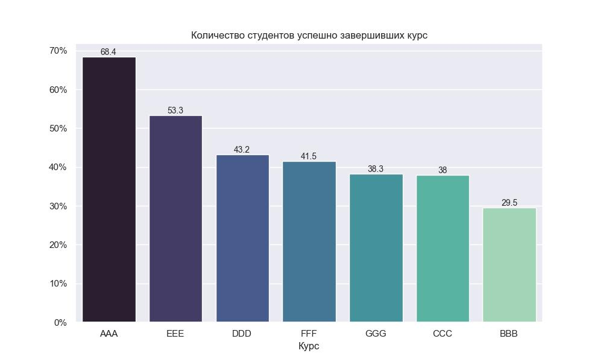
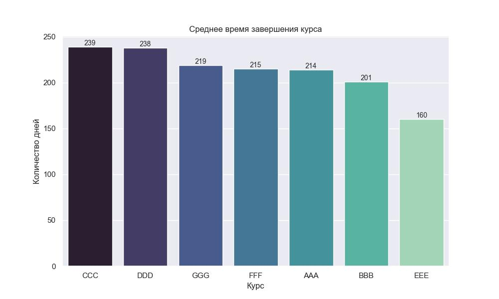
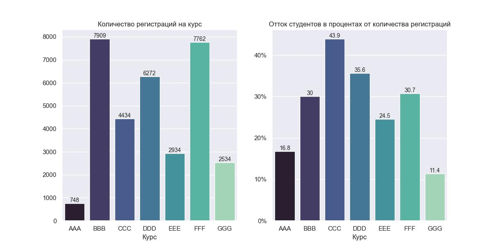
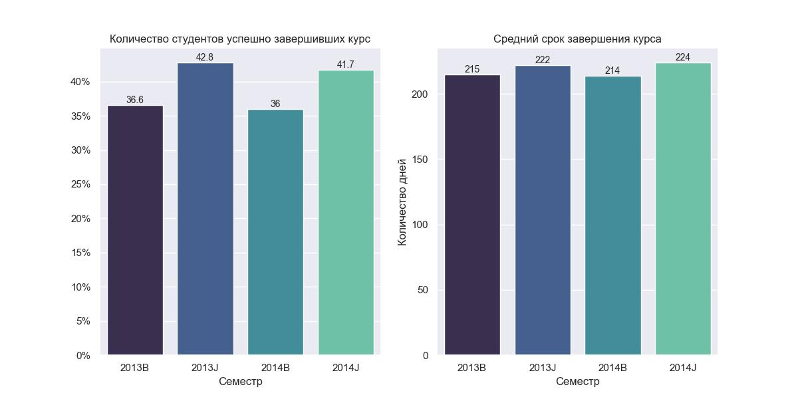
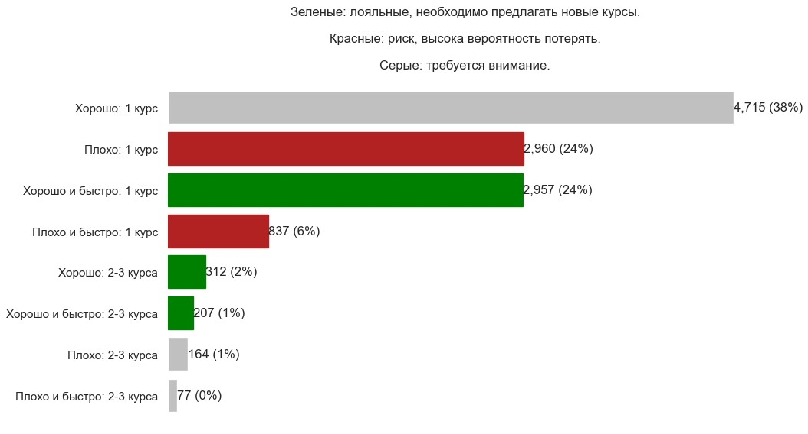

<h1>E-learning: анализ курсов</h1>

На основе данных:

<ul>
  <li>assessments.csv — содержит информацию об оценках в тесте.</li>
  <li>courses.csv — содержит список предметов по семестрам.</li>
  <li>studentAssessment.csv — содержит результаты тестов студентов.</li>
  <li>studentRegistration.csv — содержит информацию о времени, когда студент зарегистрировался для прохождения курса в семестре.</li>
</ul>

Поставлены следующие задачи:

<ol>
  <li>Определить количество студентов успешно завершивших только один курс.</li>
  <li>Определить самый сложный и самый простой экзамен: курсы и экзамены в рамках курса, которые обладают самой низкой и самой высокой завершаемостью.</li>
  <li>Определить средний срок завершения курсов (под сдачей понимаем последнее успешное прохождение экзамена студентом).</li>
  <li>Определить самые популярные предметы (ТОП-3) по количеству регистраций на них и предметы с самым большим оттоком (ТОП-3).</li>
  <li>Определить семестр с самой низкой завершаемостью курсов и самыми долгими средними сроками сдачи курсов в период с начала 2013 по конец 2014 года.</li>
  <li>Дополнительно построить адаптированные RFM-кластеры студентов, чтобы качественно оценить свою аудиторию.</li>
</ol>

<h2>Основные результаты</h2>
<h3>1. Количество студентов успешно завершивших только один курс</h3>
<ul>
  <li>12992 успеешно пройденых курса</li>
  <li>1523 студента успешно окончили только 1 курс</li>
</ul>

<h3>2. Cамый сложный и самый простой экзамен</h3>
<ul>
  <li>Самая высокая завершаемость у курса AAA: 68.4%</li>
  <li>Самая низкая завершаемость у курса BBB: 29.5%</li>
</ul>

<ul>
  
Завершаемость экзаменов практически идентична:

  <li>У курса CCC: 87.89%</li>
  <li>У курса DDD: 88.99%</li>
</ul>

<h3>3. Cредний срок завершения курсов</h3>

Наибольшие сроки сдачи у курсов с экзаменом (CCC, DDD).

Слишком ранние сроки сдачи последнего задания у курса ЕЕЕ: 160 дней.

<h3>4. Cамые популярные предметы по количеству регистраций на них и предметы с самым большим оттоком</h3>

ТОП-3 курса с наибольшим количеством регистраций:

<ol>
  <li>BBB 7909 регистраций</li>
  <li>FFF 7762 регистраций</li>
  <li>DDD 6272 регистраций</li>
</ol>

ТОП-3 курса с наибольшим оттоком (процент от зарегистрированных на курс):

<ol>
  <li>CCC 43.9%</li>
  <li>DDD 35.6%</li>
  <li>FFF 30.7%</li>
</ol>

<h3>5. Cеместр с самой низкой завершаемостью курсов и самыми долгими средними сроками сдачи курсов в период с начала 2013 по конец 2014 года</h3>

Семестр с самой низкой завершаемостью курсов: 2014B (35.97%)

Семестр с самыми долгими средними сроками сдачи курсов: 2014J (223.3 дня)

<h3>6. Адаптированные RFM-кластеры студентов</h3>

Построем адаптированные RFM-кластеры студентов, чтобы качественно оценить свою аудиторию.

В адаптированной кластеризации можно выбрать следующие метрики:

<ul>
  <li>R - среднее время сдачи одного экзамена,</li>
  <li>F - завершаемость курсов,</li>
  <li>M - среднее количество баллов, получаемое за экзамен.</li>
</ul>

Выводы

<ol>
  <li>Основная проблема в том, что 92% выпускников прошли только 1 курс. Причины могут быть разные:
    <ul>
      <li>курсы разной направленности;</li>
      <li>плохое качество курсов.</li>
    </ul>
  </li>
  <li>65% студентов набрали более 70 баллов (62%: 1 курс, 3%: 2-3 курса), соответственно, наибольшее количество студентов имеют хорошую успеваемость.</li>
  <li>25% студентов набрали более 70 баллов и быстро прошли курсы (24%: 1 курс, 1%: 2-3 курса)</li>
  <li>К 30% студентов прошедших всего 1 курс требуется внимание, чтобы не потерять их совсем.</li>
</ol>

